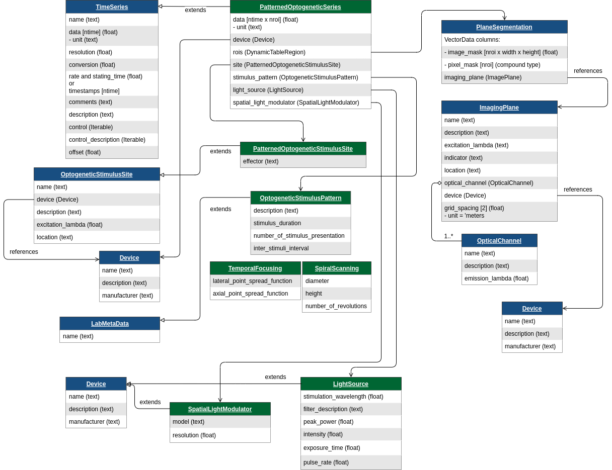

# ndx-holographic-stimulation Extension for NWB


## Installation


## Usage

```python
import datetime
import numpy as np
from pynwb import NWBFile, NWBHDF5IO
from ndx_holographic_stimulation import (
    HolographicSeries,
    HolographicStimulusSite,
    HolographicStimulusPattern,
    SpiralScanning,
    TemporalFocusing,
)
from pynwb.ophys import PlaneSegmentation, ImageSegmentation, OpticalChannel

nwbfile = NWBFile(
    session_description="session_description",
    identifier="identifier",
    session_start_time=datetime.datetime.now(datetime.timezone.utc),
)
```
We need to define a `roi_table_region` in the imaging acquisition system, to link the holographic stimulus to a set of ROIs,

```python
device_recording = nwbfile.create_device(
    name="Microscope",
    description="My two-photon microscope",
    manufacturer="The best microscope manufacturer",
)

optical_channel = OpticalChannel(
    name="OpticalChannel",
    description="an optical channel",
    emission_lambda=500.0,
)
imaging_plane = nwbfile.create_imaging_plane(
    name="ImagingPlane",
    optical_channel=optical_channel,
    imaging_rate=30.0,
    description="a very interesting part of the brain",
    device=device_recording,
    excitation_lambda=600.0,
    indicator="GFP",
    location="V1",
    grid_spacing=[0.01, 0.01],
    grid_spacing_unit="meters",
    origin_coords=[1.0, 2.0, 3.0],
    origin_coords_unit="meters",
)

n_rois = 2
plane_segmentation = PlaneSegmentation(
    name="PlaneSegmentation",
    description="output from segmenting my favorite imaging plane",
    imaging_plane=imaging_plane,
)
for _ in range(n_rois):
    plane_segmentation.add_roi(image_mask=np.zeros((10, 10)))

if nwbfile is not None:
    if "ophys" not in nwbfile.processing:
        nwbfile.create_processing_module("ophys", "ophys")
    nwbfile.processing["ophys"].add(plane_segmentation)

roi_table_region = plane_segmentation.create_roi_table_region(
    region=[0, 1], description="the first of two ROIs"
)
```
Define optical device that provide the stimulus
```python
device_stimulating = nwbfile.create_device(
    name="device",
    description="Microsope used for holography",
)
```
Define the stimulus pattern, e.g Spiral Scanning pattern:
```python
stimulus_pattern = SpiralScanning(
    name="SpiralScanning",
    description="spiral beam pattern",
    duration=15e-3,
    diameter=15e-6,
    height=10e-6,
    number_of_revolutions=5,
    number_of_stimulus_presentation=5,
    inter_stimulus_interval=10e-3,
)
nwbfile.add_lab_meta_data(stimulus_pattern)
```
Define the stimulus pattern, e.g Temporal Focusing pattern:
```python
stimulus_pattern = TemporalFocusing(
    name="TemporalFocusing",
    description="temporal focusing pattern",
    lateral_point_spread_function = "9e-6 m ± 0.7e-6 m",
    axial_point_spread_function = "32e-6 m ± 1.6e-6 m",
    duration = 10e-3,
    number_of_stimulus_presentation = 10,
    inter_stimulus_interval = 0.02,
)

nwbfile.add_lab_meta_data(stimulus_pattern)
```
Define the stimulus site: specify the effector and the stimulus pattern used
```python
holo_stim_site = HolographicStimulusSite(
    name="HolographicStimulusSite",
    device=device_stimulating,
    description="This is an example holographic site.",
    excitation_lambda=600.0,  # nm
    effector="ChR2",
    location="VISrl",
    rois=roi_table_region,
)
nwbfile.add_ogen_site(holo_stim_site)
```
Define the stimulus sequence on the ROIs previously defined in the imaging frame coordinates
```python
data = np.random.rand(100, 2)  # ntime x nroi
timestamps = np.linspace(0, 10, num=100)  # a timestamp for every frame

holographic_stimulation = HolographicSeries(
    name="holographic_stimulation",
    description="Holographic stimulus on 2 rois",
    data=data,
    unit="W",
    timestamps=timestamps,
    stimulation_wavelenght= 600.0, #nm
    stimulus_pattern=stimulus_pattern,
    site=holo_stim_site,
    device=device_stimulating,
)

nwbfile.add_stimulus(holographic_stimulation)
```
Write and read the NWBFile 
```python
path = "test_holographic_stimulation.nwb"
with NWBHDF5IO(path, mode="w") as io:
    io.write(nwbfile)

with NWBHDF5IO(path, mode="r", load_namespaces=True) as io:
    read_nwbfile = io.read()
    print(read_nwbfile)

```

---
This extension was created using [ndx-template](https://github.com/nwb-extensions/ndx-template).
